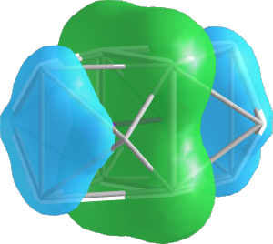

# Example system: IrIn₃

In this example, we're going to demonstrate a DFT-raMO run for an intermetallic binary compound in
the iridium-indium system, using data from a VASP 4.6 calculation. This example will follow the
scheme outlined in [this paper](https://doi.org/10.1021/acs.inorgchem.3c01496).

## Setup

Assuming that you have Julia and DFTraMO.jl installed, download the IrIn₃ VASP 4.6 data, a link to
which will be provided in the future. This includes the following files:
  
  - `KPOINTS`
  - `OUTCAR`
  - `POSCAR`
  - `POTCAR`
  - `WAVECAR`
  - `step1.yaml` - the DFT-raMO input file.
  - `qdftramo` and `qdftramo-kestrel` - submission scripts for internal use, can be adapted.
  - `step2.tar`
  - `step3.tar`
  - `step4.tar` - tarballs for later steps in the tutorial.

!!! warning "Large files"

    The tarball is a large file due to the `WAVECAR` (over 400 MB).

## 1. Ir ``d_{x^2+y^2}`` orbitals
### Constructing the YAML input

You'll find that `step1.yaml` is a blank template. The [Usage](../usage/index.md) section of the manual contains
information on each of the keys and values in the file.

Since we're starting from scratch, the `checkpoint` key should be blank. Leave `auto_psphere` as
`true`, as this will automatically rerun poor reconstructions (less than 15% of the maximum
``P_{sphere}`` value).

For the first run, let's reconstruct the Ir ``d_{x^2+y^2}`` orbitals, so set `type` to `dx2y2` and
`sites` to `Ir`. `site_file` and `radius` can be blank, as these are not used for AO type runs.
For `rsphere`, as a rule of thumb, you can use the distance from the reconstruction site to the
farthest atom in the first coordination sphere, which is `2.65` Å in this case. This does not have
to be precise, and overshooting is generally better than undershooting.

The `name` field can be set at your convenience (here we use `1_Ir_dx2y2`) and becomes the name of
the directory where the outputs are written.

Your `step1.yaml` file should look as below:

```yaml
checkpoint:
auto_psphere: true
runs:
  - name: 1_Ir_dx2y2
    type: dx2y2
    site_file: 
    sites: Ir
    radius:
    rsphere: 2.65
```

### Running DFT-raMO for the first time

In the directory you extracted the tarball, run julia, use the DFTraMO.jl package, and start the
run:

```julia-repl
julia> using DFTraMO

julia> dftramo_run("step1.yaml")
```

You should see the beginnings of the DFT-raMO analysis printed to the terminal.
```
No checkpoint file specified. Run will start from beginning conditions.
Auto-Psphere: true
Number of runs: 1
Run 1:
   name: 1_Ir_dx2y2
   type: dx2y2
   sites: Ir
   rsphere: 2.65 Å
Run: 1_Ir_dx2y2
1, Psphere: 0.905 at site [2.417, 2.417, 0.000]
```

!!! note "Optional UnicodePlots implementation"

    You can use the `UnicodePlots` package to visualize ``P_{sphere}`` data. If you don't
    load the package, you will see the following message.
    ```
    [ Info: UnicodePlots not loaded: consider loading it for Psphere logging.
    ```
    This has no impact on your DFT-raMO analysis and can be ignored.

### Examining the output
After `dftramo_run()` is finished, you should see lines of ``P_{sphere}`` values printed to the
terminal.
```
1, Psphere: 0.905 at site [2.417, 2.417, 0.000]
```
* `1` - the raMO number in the sequence.
* `0.905` - ``P_{sphere}`` value.
* `[2.417, 2.417, 0.000]` - the site (in Cartesian coordinates) that ``P_{sphere}`` is centered on.

The value of ``P_{sphere}`` indicates the degree of localization of that raMO function. Though
higher values indicate more localization, recall that our setting of `rsphere` was an arbitrary and
estimated value. What is more valuable is the consistency of the ``P_{sphere}`` values. Here, the
consistent values indicates that the Ir ``d_{x^2+y^2}`` orbitals are fully occupied.

See [Theory](../theory.md) for more details on ``P_{sphere}``.

If you check your working directory now, you should see a directory with the `name` you specified
in `step1.yaml`. Within this directory are four types of files:

1. `*.chkpt` - checkpoint at that step in the raMO sequence
2. `*.raMO` - reciprocal space coefficients for the raMO
3. `*.xsf` - real space electron density grid of the raMO in the supercell
4. `*_psphere_*.txt` - ``P_{sphere}`` information

The `.xsf` files allow us to visually inspect the raMO functions with software such as
[VESTA](https://jp-minerals.org/vesta/en/).

!!! note "File naming convention"
    
    `.chkpt`, `.raMO`, and `.xsf` files are formatted
    `<name>_<raMO number>_<electrons left in supercell>`.

    For example, `1_Ir_dx2y2_10_556.xsf` represents the 10th raMO in the sequence, with 556 electrons
    remaining and unaccounted for.

    ``P_{sphere}`` files have the `rsphere` value embedded in their filename.

## 2. Ir-Ir isolobal bonds with  ``sp`` hybrids

Before we reconstruct ``sp``-based hybrids, we want to reconstruct all of the Ir ``d`` and ``s``
orbitals. Skip ahead in the analysis by untarring the `step2.tar` file, which contains all of
the necessary reconstructions.

```
tar -xf step2.tar
```

```@raw html
<br><center><p></p>
<p><i>Ir-Ir isolobal bonding</i></p></center><br>
```

This next section of the raMO sequence will target Ir-Ir isolobal bonding. We want to create
multi-center bonding functions between pairs of Ir atoms, with expected contribution from bridging
In atoms. For this, we will use the `sp` type run, which searches for atoms within a specified
radius from a central site and creates a target where ``s`` and ``p`` orbitals are oriented towards
the central site.

For this next run, create a new YAML input (`step2.yaml`) with the following lines:
```yaml
checkpoint: 6_Ir_s/6_Ir_s_192_192.chkpt
auto_psphere: true
runs:
  - name: 7_Ir-Ir
    type: sp
    site_file: Ir-Ir.txt
    sites: all
    radius: 1.6
    rsphere: 3.5
```
Our previous analysis ended at the 192nd raMO in the sequence, and we have 192 electrons remaining,
(explaining the occurrence of 192 twice in the name of the checkpoint file). The `radius` parameter
is the search radius for automatically including atoms in the target. 

The `Ir-Ir.txt` site file should contain the midpoints of the Ir-Ir bonds in Cartesian coordinates.
This can be done by using your preferred molecular modeling software (we've done this by converting
the `POSCAR` to a `CIF` and adding the dummy atoms into
[Diamond 3](http://www.crystalimpact.com/diamond/)). However, if you'd like to skip the manual
creation, the contents of `Ir-Ir.txt` are given below:
```
X	  6.99330	  6.99330	 10.78620
X	  0.00000	  6.99330	 10.78620
X	  6.99330	  0.00000	 10.78620
X	  0.00000	  0.00000	 10.78620
X	  6.99330	  6.99330	  3.59540
X	  6.99330	  0.00000	  3.59540
X	  0.00000	  0.00000	  3.59540
X	 10.48995	 10.48995	  7.19080
X	  3.49665	 10.48995	  7.19080
X	 10.48995	  3.49665	  7.19080
X	  0.00000	  6.99330	  3.59540
X	  3.49665	  3.49665	  7.19080
X	 10.48995	 10.48995	  0.00000
X	  3.49665	 10.48995	  0.00000
X	 10.48995	  3.49665	  0.00000
X	  3.49665	  3.49665	  0.00000
```
The symbol `X` can be changed arbitrarily.

Now that you have these files, you can just run DFT-raMO again:
```julia-repl
julia> dftramo_run("step2.yaml")
```

As before, have a look at the ``P_{sphere}`` values and XSF files to see the reconstructions
and validate the electronic assignment.

## 3. Ir p orbitals with LCAO reconstructions

When working with orbitals with nonzero orbital angular momentum (``p``, ``d``, ``f`` orbitals) it
may be desirable to construct an orbital with an orientation or shape that is not aligned with the
coordinate system. To solve this issue, we can use linear combinations of atomic orbitals (LCAOs).
LCAOs may also be used to create molecular or multi-center bonding functions, i.e. π-bonding.

To skip to the next step, untar `step3.tar` in your working directory. You should find two new input
files, `lcao1.yaml` and `lcao2.yaml`. The contents of `lcao1.yaml` are given below:
```yaml
target:
  - px: -1
    py: 1
lcao:
  - [1]
  - [2]
  - [17]
  - [18]
  - [33]
  - [34]
  - [49]
  - [50]
  - [65]
  - [66]
  - [81]
  - [82]
  - [97]
  - [98]
  - [113]
  - [114]
```
As before, the description of the LCAO sites file is given in the [Usage](../usage/index.md) section.

Note that `lcao2.yaml` file contains reconstructions with different orientations (``p_x`` is positive).

The `step3.yaml` file contains the information for the LCAO reconstruction, and references both
`lcao1.yaml` and `lcao2.yaml` for each run. Its contents are below:
```yaml
checkpoint: 8_Ir_pz/8_Ir_pz_240_96.chkpt
auto_psphere: true
runs:
  - name: 9_Ir_p_pi1
    type: lcao
    site_file: lcao1.yaml
    sites: all
    radius:
    rsphere: 2.65
  - name: 10_Ir_p_pi2
    type: lcao
    site_file: lcao2.yaml
    sites: all
    radius:
    rsphere: 2.65
```

Run `step3.yaml` and inspect the ``P_{sphere}`` values and XSF files.
```julia-repl
julia> dftramo_run("step3.yaml")
```

# 4. Remainder analysis of In cage states and In ``p`` orbitals

As you complete your DFT-raMO runs, you'll find that the ``P_{sphere}`` values of the reconstructed
orbitals tends to decrease. To visualize this, untar `step4.tar` and look at the log for run 11,
found at `11_In-In/11_In-In_psphere_4.73.txt`:
```
273     0.6474487830205945       at site [10.490, 3.497, 3.595]
274     0.6429286864719969       at site [0.000, 6.993, 7.191]
275     0.6116188776692522       at site [3.497, 10.490, 3.595]
276     0.6382205090625862       at site [10.490, 10.490, 3.595]
277     0.6504732377051952       at site [6.993, 6.993, 7.191]
278     0.5981010110158822       at site [3.497, 3.497, 10.786]
279     0.5871384506957702       at site [10.490, 3.497, 10.786]
280     0.5162750706706059       at site [3.497, 10.490, 10.786]
281     0.33634765527327326      at site [10.490, 10.490, 10.786]
282     0.6434855799801233       at site [0.000, 0.000, 0.000]
283     0.6433852489950562       at site [6.993, 0.000, 0.000]
284     0.5527474698233648       at site [0.000, 6.993, 0.000]
285     0.49587592534638286      at site [6.993, 6.993, 0.000]
286     0.40417825671730373      at site [0.000, 0.000, 7.191]
287     0.16723350141820606      at site [6.993, 0.000, 7.191]
288     0.1572312564858335       at site [3.497, 3.497, 3.595]
```
We find that ``Psphere`` drops precipitously at some points in this run (raMOs 281, 286-288).
In order to complete the analysis, we need to open the XSF files to inspect the character of the
raMO functions more closely. For reference and throughness, it is recommended to inspect the raMO
functions directly preceding these (raMOs 280, 285).

```@raw html
<br><center><p></p>
<p><i>From left to right: isosurfaces of raMO 280, 281, 287, 288</i></p></center><br>
```

Upon inspection of these raMOs, we come to the following conclusions:
* raMOs 280, 281, and 286 show delocalization but expected character, so electrons are allocated to
  these runs.
* raMOs 287 and 288 show delocalization and unexpected p-like character on the In atoms. Electrons
  are not assigned to these raMOs and the functions are returned to the basis set. However, the
  ``p``-like character informs our next target, as raMO functions are orthogonal to each other.

For the final run, we now target the In ``p`` orbitals. Create the last input file, `step4.yaml`:
```yaml
checkpoint: 11_In-In/11_In-In_286_4.chkpt
auto_psphere: true
runs:
  - name: 12.1_In_px
    type: px
    site_file: 
    sites: In 1
    radius:
    rsphere: 3.2
  - name: 12.2_In_py
    type: py
    site_file: 
    sites: In 1
    radius:
    rsphere: 3.2
  - name: 12.3_In_pz
    type: pz
    site_file: 
    sites: In 1
    radius:
    rsphere: 3.2
```
Run DFT-raMO.
```julia-repl
julia> dftramo_run("step4.yaml")
```

The ``P_{sphere}`` values are still low, but this is expected. Isosurfaces in the XSFs show
delocalized ``p``-like functions throughout the In atoms in the cell.

!!! note "Congratulations!"
    🌟 You performed a DFT-raMO analysis!