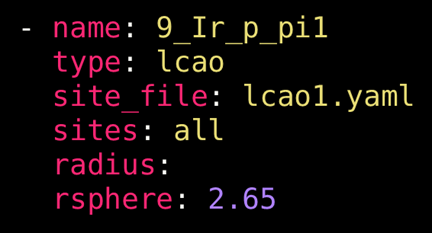

# LCAOs

## Overview

Linear combinations of atomic orbitals (LCAOs) are also available target options in DFT-raMO.jl. A user can more precisely specify the contribution of different AOs on multiple atoms to the target, allowing users to rotate AOs (such as a combination of ``p_x`` and ``p_y`` orbitals) or target π-bonding between two atoms. Due to the complexity of the customization, a separate YAML file reserved for LCAO-type customization is necessary to reduce clutter in the instructional YAML file. Details of this separate YAML file are discussed [below](#The-LCAO-YAML).

The keys and options for LCAO-type runs are similar to *sp*-type runs. The `site_file` key must point to the [LCAO-specific YAML](#The-LCAO-YAML), and the `sites` key now is limited to integers that correspond to the sites listed in the LCAO-specific YAML or the `all` keyword. Unlike the *sp*-type runs, the `radius` keyword can be left blank or omitted entirely.

```@raw html
<br><center><p></p>
<p><i>Example options for a lcao-type run.</i></p></center><br>
```

## The LCAO YAML

Now, let’s examine the options for the YAML file exclusively for customizing the targeted LCAOs (`lcao1.yaml` in the above figure). The YAML file has two keys that serve as lists: `target` and `lcao`. Each list item in `target` specifies contributing AOs for that atom. The possible keys in each item are AOs: `s`, `px`, `py`, `pz`, `dx2y2`, `dz2`, `dxy`, `dxz`, `dyz`. The options for these keys are numerical values corresponding to the relative contribution of that AO to the LCAO (these values will be normalized with respect to the entire LCAO).

### LCAOs on one atomic site
Example options in the LCAO YAML targeting rotated *p* orbitals:

```yaml
target:
  - px: -1
    py: 1
lcao:
  - [1]
  - [2]
  - [17]
  - [18]
  - [33]
  - [34]
  - [49]
  - [50]
  - [65]
  - [66]
  - [81]
  - [82]
  - [97]
  - [98]
  - [113]
  - [114]
```

Here are some of the important components of this example file:
  - The `target:` key indicates that a list of LCAOs will follow. Each atomic site is indicated with
    a `-`, and relative contributions of each atomic orbital follow each atomic orbital key.
      + Relative contributions of each atomic orbital will be normalized such that the total
        contribution equals 1.
      + Any atomic orbital keys that are notdefined are ignored.
  - The `lcao` key indicates the list of targets in the run.
      + Each list item must be a vector of integers indicating the number corresponding to the atom
        in the supercell. These atomic positions can usually be found by checking the xsfs of a
        previously run.
      + The number of integers in the list *must* match the number of atomic sites in `target`.

Because only one atom is targeted per raMO in the example above, `target` only has one list item. Within that list, only the `px` and `py` keys are specified, with values of `-1` and `1`, respectively. Because these are equal in magnitude, after normalization, they will contribute equally to the target function for a *p*-like orbital rotated 45° with respect to the y- axis.

Next, the `lcao` list specifies which atoms participate in the each raMO in the sequence. Each item in the list must be a vector of integers that must have an equal number of items to the number of list items in target. In the example above, since AOs on only one atom are targeted, the vectors have only one integer in them. The integers in these vectors correspond to the order of atoms in the periodic atom list of the supercell. For the example above, the first raMO of the sequence will target a LCAO of ``p_x`` and ``p_y`` orbitals on atom 1. The second raMO will target an analogous LCAO on atom 2. And so on.

### LCAOs on multiple atomic sites

To target contributions from multiple atoms in a single raMO (e.g. σ-bonds, π-bonds), the `target` list should have multiple items, and each vector in the `lcao` list should increase accordingly.

```yaml
target:
    - px: -1
      py: 1
    - px: -1
      py: 1
lcao:
    - [1, 2]
    - [17, 18]
    - [33, 34]
    - [49, 50]
    - [65, 66]
    - [81, 82]
    - [97, 98]
    - [113, 114]
```

In the example given above, target has two items in its list (both rotated *p*-orbitals) and each vector in the `lcao` list contains two integers. These integers, in order, correspond to the items in the `target` list.