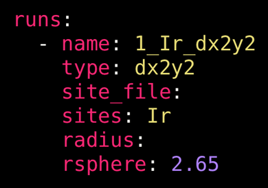
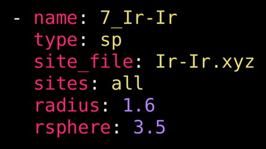
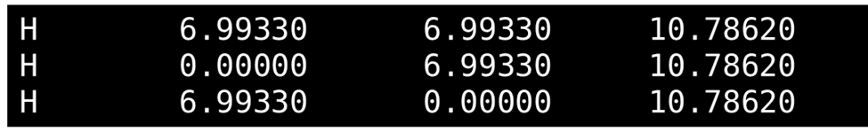
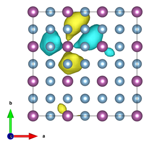

# The Instructional YAML file

!!! note
    See also [Keys for the Instructional YAML](in-yaml-keys.md)

DFT raMO.jl requires an instructions file to customize and perform the analysis. This file specifies input files, checkpoint files, and other necessary parameters. The input file must be written in YAML format (with the .yml or .yaml extension), which consists of a series of keys and values separated by colons. Lists are defined with a hyphen and spaces. Below is an example of inputs for the instructions file for DFT-raMO.jl.

Example YAML file:
```yaml
checkpoint:
software: vasp
mode: auto_psphere
emin: -100 eV
emax:
runs:
   - name: 1_Ir_dx2y2
     type: dx2y2
     sites_file: 
     sites: Ir
     rsphere: 2.65
   - name: 2_Ir_dz2
     type: dz2
     sites_file: 
     sites: Ir
     rsphere: 2.65
```

Here are some of the important components of this example file:
  - The `checkpoint` key can be left blank when starting a new calculation to use an initial basis set generated from the DFT calculations. Checkpoint files are automatically written by DFT-raMO. A path to a file can be given to resume the calculation. 
  - The `software` key specifies which DFT software generated the wavefunction information.
  - The `mode` key is set to `auto_psphere` mode, allowing DFT-raMO to automatically reject functions that do not meet the criteria set by ``P_{sphere}`` analysis.
  - The `emin` and `emax` keys allow the user to specify the energy range (in eV or Ha) of bands used in the initial basis set — leaving these values blank will default to using all bands below the Fermi energy.
  - The `runs` key indicates a list of raMO sequences will follow. Each sequence is prepended with spaces and a hyphen. Keys within the list item are exclusive to that sequence.
      + The `name` key requires a string which will be used to ame the directory that stores the sequence's output files. By default, the name is `run_<number>` where `<number>` is the number in the order.
      + The `type` key determines the target orbital shapes to reconstruct: atomic orbitals (`s`, `px`, `py`, `pz`, `dx2y2` or `dx2-y2`, `dz2`, `dxy`, `dxz`, and `dyz`), sp-based orbitals built from a distance criteria (`sp`), linear combination of atomic orbitals (`lcao`), or displaced atomic orbitals (`displaced (AO)`).
      + The `rsphere` key corresponds to the distance from the central site to consider for ``P_{sphere}`` analysis in Angstroms.

A complete table of general keys and options are listed in the [Keys for the Instructional YAML](in-yaml-keys.md).

## Atomic orbital-type runs

Atomic orbital (AO)-type runs, as the name suggests, are for reconstructing raMOs that replicate atomic orbitals. For AO-type runs (type: `s`, `px`, `py`, `pz`, `dx2y2`, `dz2`, `dxy`, `dxz`, or `dyz`), the sites key specifies which atomic sites to generate the AO for. This can be a number of options.

The most common option is to specify all atoms of a certain type.

```yaml
sites: Ir
```

It is also possible to specify the first site of that element only.

```yaml
sites: Ir 1
```

A range of atoms can also be selected specific to an atomic element,

```yaml
sites: Ir 1, 3:5, 12
```

or in order of the periodic atom list corresponding to the supercell.

```yaml
sites: 8, 10, 122:144
```

```@raw html
<br><center><p></p>
<p><i>Example options for an atomic orbital-type run.</i></p></center><br>
```

## *sp*-type runs

The *sp*-type runs are generally used to build molecular orbital-like targets with a distance-based criteria. From a central site, DFT-raMO.jl will search for atoms within a specified radius whose *s* and *p* orbitals are expected to contribute to the raMO. The *sp*-type run option is typically used in the reconstruction of isolobal bonds or multicentered bonding functions. 

For *sp*-type runs, the `radius` key is now required, and it specifies the distance (in Angstroms) from the central site to search for atoms to include in the generation of the bonding function. The `sites_file` key is also now required; it must be a string pointing to a text file (typically in .xyz format) that lists the sites. Below, the figure shows the content of an example sites file containing three sites: the first item in the line is a placeholder character and is ignored, and the next three items must correspond to the Cartesian coordinates of the sites.

```@raw html
<br><center><p></p>
<p><i>Example options for an <i>sp</i>-type run.</i></p></center><br>
```

For *sp*-type runs, the sites key now is limited to integers that correspond to the lines in the .xyz file. Specific sites may be specified:
```yaml
sites: 1, 2, 4:8
```
or the `all` keyword may be used to indicate that the whole list will be used in the sequence.
```yaml
sites: all
```

```@raw html
<br><center><p></p>
<p><i>Example content of an .xyz file for the </i><code>sites_file</code><i> key.</i></p></center><br>
```

## LCAO-type runs
See [LCAOs](LCAO.md).

## Displaced AO-type runs
The displaced AO-type run is an experimental feature in which the targeted AO may be displaced from the atomic site by some specified direction and distance. This feature may be relevant to properties such as polarizability. To perform this type of run, the keyword `displaced` must be prepended on the type of AO run. In addition, the `discard` mode is recommended, as this feature usually used in an exploratory context and not in a typical DFT-raMO analysis. Below is a code block with an example of an instructional YAML for a displaced AO-type run.

```yaml
checkpoint:
mode: discard
emin: -100 eV
emax: 
software: vasp
runs:
  - name: Sc_custom_dxz
    type: displaced dxz
    sites: Sc
    direction: [1, 1, 0]
    radius: 1
    rsphere: 2.2
```

Here, we are targeting displaced Sc ``d_{xz}`` atomic orbitals, as indicated by `type: displaced dxz` and `sites: Sc`. The direction of this displacement is given by `direction: [1, 1, 0]`, where the vector corresponds to the *a*, *b*, and *c* unit cell vectors, meaning any values of the vector must correspond to the fractional coordinate system. This vector is later normalized by DFT-raMO.jl to obtain a unit vector. The `radius` key specifies the displacement along the directional unit vector in Å. In the above example, we displace the ``d_{xz}`` atomic orbital by 1 Å. The raMO sequence can be executed normally and output files obtained.

```@raw html
<br><center><p></p>
<p><i>A displaced Sc d<sub>xy</sub> raMO in AuCu<sub>3</sub>-type ScAl<sub>3</sub>.</i></p></center><br>
```